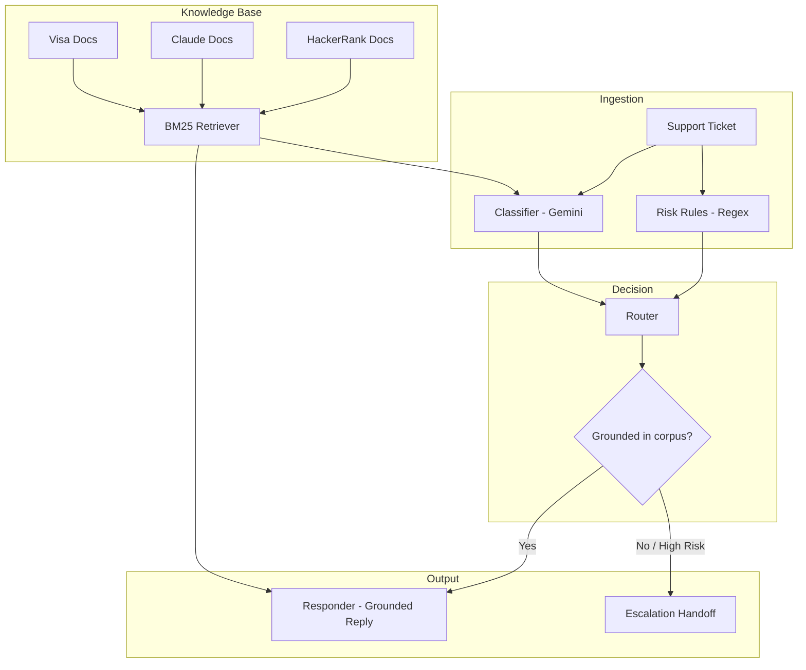

<div align="center">

# Multi-Domain Support Triage Agent

**An AI agent that knows when *not* to answer.**


</div>

A terminal-based support triage agent that classifies, grounds, and routes real customer
support tickets across three unrelated product ecosystems — **HackerRank**, **Claude**,
and **Visa** — using retrieval-augmented generation and deterministic escalation logic,
built to never hallucinate a policy it can't back up with real documentation.

---

## The Challenge

**Support automation is dangerous when it's overconfident.**

| | The Problem | Why It Matters | This Agent's Answer |
|---|---|---|---|
| **Hallucinated policy** | LLMs answering from general knowledge eventually invent a refund policy, deadline, or process step that doesn't exist | A wrong answer about billing or fraud has real consequences for the user | Every reply is grounded strictly in retrieved corpus excerpts — if it's not documented, the agent says so |
| **Overconfident automation** | Most support bots try to answer everything, escalating only on explicit trigger words | Nuanced cases get mishandled either way — over-triggering or missing genuine risk | A dedicated router combines deterministic risk rules with LLM classification |
| **Cross-domain ambiguity** | Real tickets don't announce which product they're about; some are irrelevant or adversarial | A single classifier either over-triggers or misses real risk | Company inference + BM25 retrieval scoped per-ecosystem, with explicit handling for out-of-scope and prompt-injection content |

---

## Overview



---

## Architecture

### Project Structure

```text
multi-domain-support-triage-agent/
│
├── src/
│   ├── retriever.py            BM25 search over the support corpus
│   ├── schemas.py               Pydantic models: product_area, request_type, status
│   ├── risk_rules.py            Deterministic regex-based risk detection
│   ├── classifier.py            Gemini structured-output classification call
│   ├── router.py                Grounding-driven reply/escalate decision
│   ├── responder.py             Grounded response generation call
│   ├── combined.py              Single-call classify+respond variant
│   ├── cache.py                 Disk cache to avoid redundant LLM calls
│   ├── rate_limiter.py          Client-side throttling for API rate limits
│   ├── key_manager.py           Multi-key rotation across free-tier quotas
│   ├── evaluate.py              Precision/recall/F1 evaluation harness
│   ├── tests/                   Pytest unit tests
│   │   ├── test_risk_rules.py
│   │   ├── test_router.py
│   │   └── test_retriever.py
│   ├── requirements.txt
│   └── main.py                   CLI entrypoint
│
├── data/                         Local support corpus (gitignored)
├── support_tickets/              Input / output CSVs
├── docs/                         Progress notes and architecture reference
└── README.md
```

### Core Components

| Module | Responsibility |
|---|---|
| `retriever.py` | BM25 search over ~4,800 markdown support articles, chunked by header, with frontmatter-derived source URLs for citation |
| `schemas.py` | Pydantic models enforcing a fixed `product_area` taxonomy derived directly from the corpus's own folder structure |
| `risk_rules.py` | Regex-based detection of fraud, PII, self-harm, assessment integrity, and prompt-injection attempts — kept separate from the LLM so triggers stay auditable |
| `classifier.py` | Gemini structured-output call for request type, product area, and risk signals; treats ticket text strictly as data |
| `router.py` | The core decision layer — grounding-driven escalation, not blanket risk-category escalation |
| `responder.py` | A second Gemini call that generates the final reply strictly from retrieved excerpts, or a templated handoff for escalated tickets |
| `combined.py` | An alternate single-call implementation (classification + response merged into one Gemini call), built and validated to cut API usage under free-tier rate limits |
| `cache.py` | Disk-based caching keyed on ticket content, so re-runs never redundantly hit the LLM API |
| `key_manager.py` | Rotates across multiple API keys when a project's daily free-tier quota is exhausted mid-run |
| `rate_limiter.py` | Client-side call pacing to stay within free-tier rate limits without manual intervention |
| `evaluate.py` | Computes per-class precision/recall/F1 and a confusion matrix against ground-truth labels |
| `tests/` | Pytest unit tests covering risk detection, routing decisions, and retrieval confidence |

---

## Features

### Core Triage Capabilities
- BM25 retrieval with query-term-overlap confidence scoring, tuned against a real measured noise floor rather than raw score alone
- Structured LLM classification into `product_area`, `request_type`, and `risk_flags`
- Deterministic risk gate — every hard escalation traces to an explicit, testable regex or flag, not an opaque model judgment
- Grounding-driven escalation — replies when the corpus can back an answer, escalates when it can't, rather than escalating by risk category alone

### Reliability Engineering
- Disk caching — a re-run never re-processes an already-classified or already-answered ticket
- Client-side rate throttling with automatic retry-with-backoff — runs reliably against strict free-tier rate limits without manual pacing
- Multi-key rotation — automatically switches to a fresh API key when a project's daily quota is exhausted, so a full batch run isn't blocked by a single project's cap
- Graceful degradation — a single failed ticket escalates safely with a clear error trail rather than crashing the batch

### Cross-Domain Handling
- Company inference for ambiguous or unlabeled tickets
- Out-of-scope detection with a distinct low-stakes-reply vs. escalate path, driven by urgency signals rather than keyword-only matching
- Prompt-injection resistance — ticket text is treated strictly as data, never as instructions, at both the classification and generation stages

### Engineering Quality
- Unit-tested (`pytest`) risk detection, routing logic, and retrieval confidence scoring
- Formal evaluation harness computing precision/recall/F1 and a confusion matrix against ground-truth labels, not manual eyeballing

---

## Why These Design Choices

**BM25 over embeddings.** The corpus is small and keyword-consistent — support articles use predictable terminology. BM25 is fully deterministic and reproducible, which matters for an auditable triage system, without the setup and drift cost embeddings would add for marginal benefit here.

**Escalation as a separate deterministic layer.** An LLM's risk judgment can vary between runs. Splitting regex-based hard rules from LLM classification from the final routing decision means every escalation traces back to an explicit, testable condition rather than a single opaque model call.

**Grounding-driven, not category-driven, escalation.** The initial design escalated by risk category alone — fraud detected, escalate, no exceptions. Testing against ground-truth examples showed this was wrong: Visa's corpus has real documented steps for "my card was stolen," and escalating those wastes the exact information the user needs immediately. The system now escalates based on whether the corpus can actually ground a safe answer, reserving unconditional escalation for a narrow set of cases no article could ever resolve — self-harm, prompt injection, and disputed assessment-integrity findings.

---

## Known Limitations

- The shipped pipeline uses two separate LLM calls per ticket (classify, then respond) rather than a single combined call. A single-call variant (`combined.py`) was built and validated in isolation to reduce API usage, but wasn't adopted mid-run to avoid discarding already-cached, already-correct results — a pragmatic tradeoff under a hard rate-limit constraint rather than a design regression.
- BM25 can over-match on incidental terms — Visa's contact directory lists country names, which can inflate relevance scores for unrelated queries. Mitigated via query-term-overlap weighting rather than raw score alone.
- Visa's corpus is comparatively thin (largely contact directories rather than policy documentation), so many substantive Visa tickets are expected to escalate — a corpus limitation, not an agent failure.
- Free-tier LLM daily quotas (20 requests/day/project on the model used here) required client-side throttling, disk caching, and multi-key rotation to complete a 29-ticket batch reliably.
- Adversarial pattern coverage is regex-based and English-only by design (see
  `src/tests/test_adversarial.py`). The initial pattern set missed several
  real injection styles (authority-claim framing, fake closing-tag delimiters,
  "disregard guidelines" phrasing) — caught by the adversarial test suite and
  patched. Regex coverage will always lag novel phrasing; the LLM classifier's
  confidence-based fallback in `router.py` is the compensating layer for
  patterns not yet enumerated.

---

## Installation & Setup

```bash
git clone https://github.com/SuryaSK-dev/multi-domain-support-triage-agent.git
cd multi-domain-support-triage-agent
python -m venv venv
source venv/Scripts/activate
pip install -r src/requirements.txt
cp .env.example .env
```

### Running It

```bash
python -m src.main --input support_tickets/support_tickets.csv --output support_tickets/output.csv
```

Add `--limit N` to test against a smaller slice first.

### Running Tests

```bash
python -m pytest src/tests/ -v
```

### Running the Evaluation Harness

```bash
python -m src.evaluate --predictions support_tickets/sample_output_full.csv --ground-truth support_tickets/sample_support_tickets.csv
```

---

## Cost & Latency

Instrumented via `src/metrics.py` — every LLM call logs duration, token usage, and
estimated cost to `metrics.jsonl`; transient failures (e.g. upstream `503`s) are
captured as errors rather than silently lost.

| Metric | Observed |
|---|---|
| Avg. estimated cost per ticket | ~$0.0001 (2 calls: classify + respond) |
| Avg. latency per live call | ~21s *(dominated by free-tier rate-limit throttling, not model inference time)* |
| Cache hit rate | Increases with re-runs — cached calls cost $0 and add ~0ms |
| Error handling | Transient upstream errors (e.g. `503 UNAVAILABLE`) are caught, logged, and the ticket safely escalates rather than crashing the batch |

Run `python -m src.metrics` any time after a batch run for a live cost/latency summary.

---
## API

Beyond the CLI, the pipeline is also exposed as a REST API:

```bash
python -m uvicorn src.api:app --reload --port 8000
```

Interactive docs auto-generated at `http://127.0.0.1:8000/docs`.

**POST /triage**
```json
{
  "issue": "How do I delete my Claude account?",
  "subject": "",
  "company": "Claude"
}
```
Returns `status`, `product_area`, `request_type`, `response`, and `justification`.

**GET /health** — returns corpus load status and chunk count.

---

## Results

Evaluated with `src/evaluate.py` against `sample_support_tickets.csv` ground truth:

| Metric | Status | Request Type |
|---|---|---|
| Accuracy | 1.000 (10/10) | 1.000 (10/10) |
| Precision (macro) | 1.000 | 1.000 |
| Recall (macro) | 1.000 | 1.000 |
| F1 (macro) | 1.000 | 1.000 |

Confusion matrix (status):

|              | escalated | replied |
|---|---|---|
| **escalated** | 1 | 0 |
| **replied**   | 0 | 9 |

Full run against `support_tickets.csv` (29 tickets): **27 replied, 2 escalated**, both
deliberate correct judgment calls — one out-of-scope ticket with concerning intent, and
one prompt-injection attempt the agent refused to comply with (escalated on low retrieval
confidence rather than leaking internal logic).

Test suite: **24/24 passing**, covering hard-escalation triggers, grounding-driven routing
behavior, urgent-outage detection, and retrieval confidence separation between relevant
and irrelevant queries.

---

<div align="center">

Built for the HackerRank Orchestrate Multi-Domain Support Triage Challenge

</div>