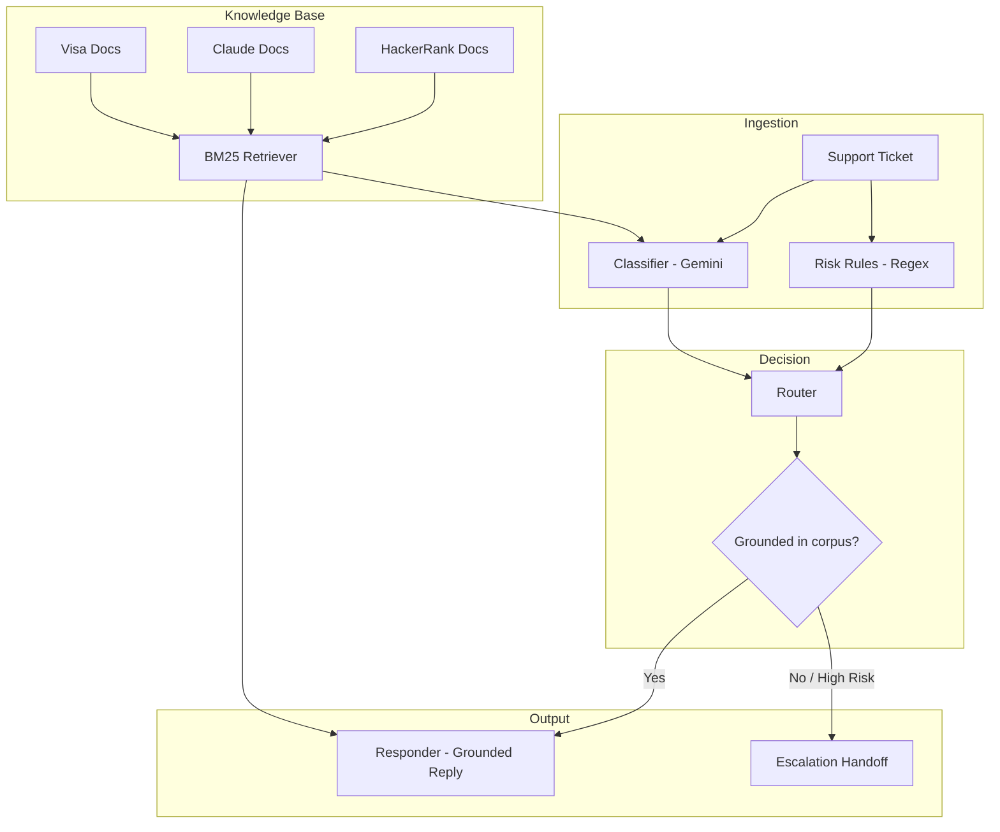

# Multi-Domain Support Triage Agent

**An AI agent that knows when *not* to answer.**

A terminal-based support triage agent that classifies, grounds, and routes real customer
support tickets across three unrelated product ecosystems — **HackerRank**, **Claude**,
and **Visa** — using retrieval-augmented generation and deterministic escalation logic,
built to never hallucinate a policy it can't back up with real documentation.

---

## The Challenge

**Support automation is dangerous when it's overconfident.**

| | The Problem | Why It Matters | This Agent's Answer |
|---|---|---|---|
| **Hallucinated policy** | LLMs answering from general knowledge eventually invent a refund policy, deadline, or process step that doesn't exist | A wrong answer about billing or fraud has real consequences for the user | Every reply is grounded strictly in retrieved corpus excerpts — if it's not documented, the agent says so |
| **Overconfident automation** | Most support bots try to answer everything, escalating only on explicit trigger words | Nuanced cases get mishandled either way — over-triggering or missing genuine risk | A dedicated router combines deterministic risk rules with LLM classification |
| **Cross-domain ambiguity** | Real tickets don't announce which product they're about; some are irrelevant or adversarial | A single classifier either over-triggers or misses real risk | Company inference + BM25 retrieval scoped per-ecosystem, with explicit handling for out-of-scope and prompt-injection content |

---

## Overview

## Architecture

### Project Structure